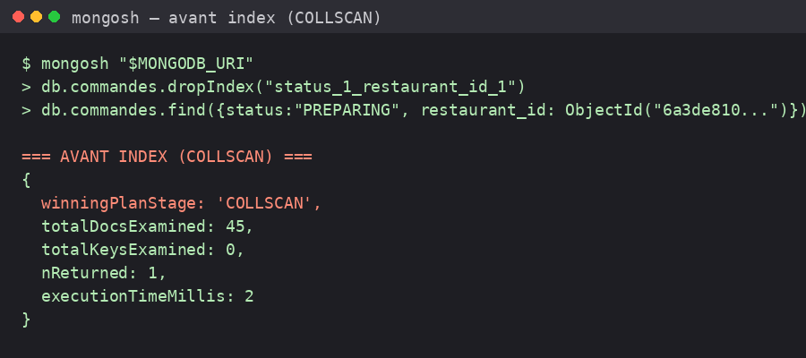
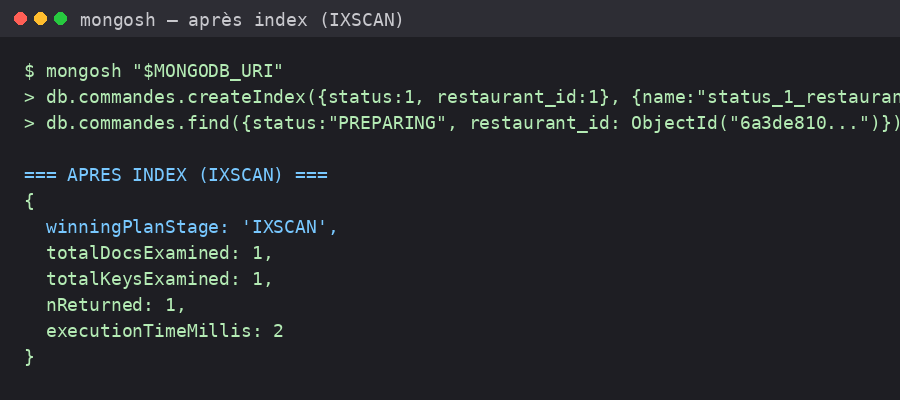

# Analyse des performances : COLLSCAN (sans index) vs IXSCAN (avec index)

## Objectif

Démontrer par la preuve (`explain('executionStats')`) que l'index composé `{ status: 1, restaurant_id: 1 }` sur la collection `commandes` transforme un parcours complet de collection (**COLLSCAN**) en un parcours d'index ciblé (**IXSCAN**).

## Contexte de la mesure

- Collection `commandes` : **45 documents** — jeu de données réellement présent dans la base `libreville_eats` au moment de la mesure (peuplé par `npm run seed` + `scripts/demo/seed-commandes-demo.js`, sur les 30 vrais restaurants de Libreville/Akanda/Owendo).
- Requête testée — cas d'usage réel : lister les commandes `PREPARING` d'un restaurant donné (utilisé par le tableau de bord du vendeur) :

```js
db.commandes.find({
  status: "PREPARING",
  restaurant_id: ObjectId("6a3de810e27da6ef59e20261"),
})
```

- Méthode : l'index composé `status_1_restaurant_id_1` a été **temporairement supprimé** (`dropIndex`) pour mesurer le plan sans index, puis **recréé à l'identique** (`createIndex`) pour mesurer le plan avec index. Aucune perte de données : l'index est revenu à son état initial à l'issue de la mesure. Cette procédure est automatisée dans `scripts/04-index.js`.

## Avant index — COLLSCAN



```json
{
  "winningPlan": { "stage": "COLLSCAN" }
}
```

| Métrique | Valeur |
|---|---|
| Stage gagnant | COLLSCAN |
| Documents examinés (totalDocsExamined) | **45** (toute la collection) |
| Clés d'index examinées (totalKeysExamined) | 0 |
| Documents retournés (nReturned) | 1 |
| Temps d'exécution mesuré | 2 ms |
| Ratio examinés / retournés | **45** |

Sans index, MongoDB doit lire l'intégralité des 45 documents de la collection pour n'en retenir qu'1 seul.

## Après index — IXSCAN



```json
{
  "winningPlan": {
    "stage": "FETCH",
    "inputStage": {
      "stage": "IXSCAN",
      "indexName": "status_1_restaurant_id_1",
      "keyPattern": { "status": 1, "restaurant_id": 1 }
    }
  }
}
```

| Métrique | Valeur |
|---|---|
| Stage gagnant | FETCH <- IXSCAN |
| Documents examinés (totalDocsExamined) | **1** |
| Clés d'index examinées (totalKeysExamined) | 1 |
| Documents retournés (nReturned) | 1 |
| Temps d'exécution mesuré | 2 ms |
| Ratio examinés / retournés | **1** |

Avec l'index composé, MongoDB localise directement le document pertinent via l'index (IXSCAN), puis va chercher (FETCH) uniquement ce document sur disque — `totalDocsExamined` passe de 45 à 1.

## Interprétation des résultats

- **Sans index** : `docsExamined` = taille totale de la collection (45), indépendamment de la sélectivité de la requête. Le coût croît linéairement avec le nombre de commandes — sur un jeu de données de production (des milliers/millions de commandes), ce même `find()` deviendrait rapidement le principal goulot d'étranglement de l'API.
- **Avec index** : `docsExamined` = `nReturned` (1 document examiné pour 1 document retourné). Le coût ne dépend plus de la taille de la collection mais de la sélectivité du filtre `(status, restaurant_id)`.
- L'ordre des champs de l'index (`status` puis `restaurant_id`) a été choisi car ce couple est interrogé conjointement sur la route la plus fréquente de l'application (tableau de bord restaurant : commandes actives d'un restaurant donné) — voir `conception/modele-donnees.md` section 4 pour la justification complète des index.
- Le gain est mesuré ici sur la taille réelle actuelle de la collection (45 documents) ; le ratio `docsExamined/nReturned` (45 sans index, 1 avec) ne fait que s'aggraver à mesure que la collection grossit, alors que le coût avec index reste stable.

## Reproduire la mesure

```bash
mongosh "$MONGODB_URI"
load("scripts/04-index.js")
```

`scripts/04-index.js` supprime puis recrée l'index `status_1_restaurant_id_1`, affiche le plan d'exécution avant et après sur une requête réelle de la collection `commandes`, et imprime un tableau comparatif `docsExamines` / `stage`. Les captures d'écran ci-dessus correspondent à une exécution réelle de cette procédure contre la base `libreville_eats`.
